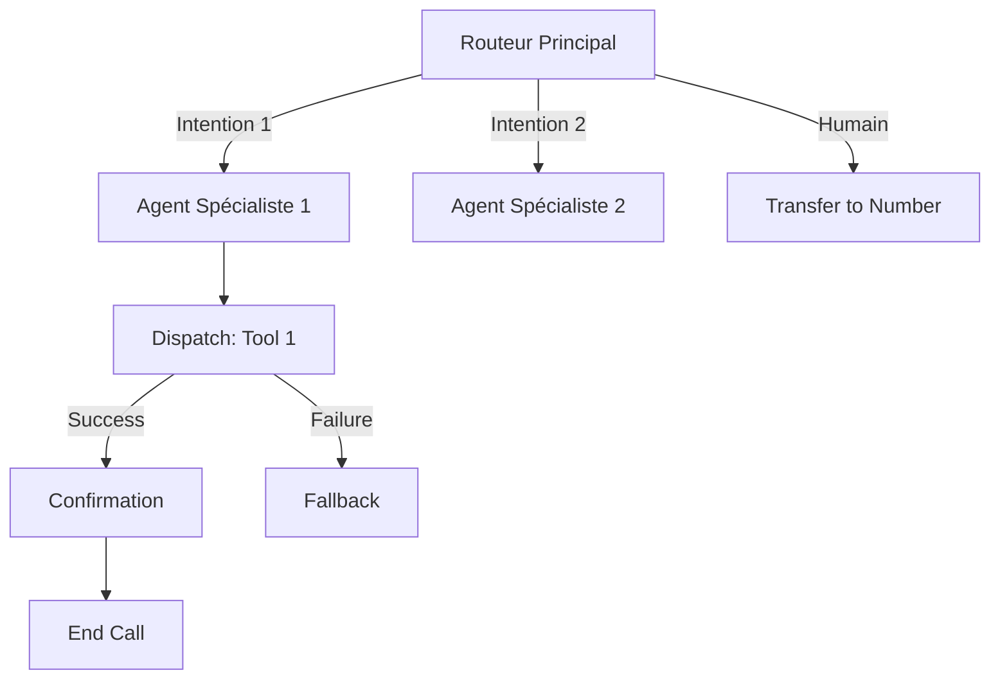

# GUIDE OPÉRATIONNEL : WORKFLOWS ELEVENLABS

**Usage** : Ce fichier permet à Claude Code de générer automatiquement tous les prompts, configurations et structures de workflows ElevenLabs selon le besoin client.

**Comment utiliser ce guide** : Quand un client exprime un besoin, Claude Code doit :
1. Identifier le type de workflow nécessaire (simple, intermédiaire, complexe)
2. Définir l'architecture des nœuds et agents
3. Rédiger tous les prompts système pour chaque agent
4. Configurer les transitions et conditions
5. Lister les outils nécessaires
6. Préparer les documents de base de connaissances

---

## 1. COMPRENDRE L'ARCHITECTURE DES WORKFLOWS

### 1.1 Concept fondamental

Un **Workflow** ElevenLabs est un graphe conversationnel composé de :
- **Nœuds (Nodes)** : Points d'interaction ou d'action
- **Arêtes (Edges)** : Transitions entre nœuds avec conditions
- **Variables** : Données dynamiques passées au runtime

```
┌─────────────┐     Condition      ┌─────────────┐
│   Nœud A    │ ─────────────────▶ │   Nœud B    │
│  (Routeur)  │                    │  (Spécialiste)
└─────────────┘                    └─────────────┘
      │                                   │
      │ Condition alternative             │ Success
      ▼                                   ▼
┌─────────────┐                    ┌─────────────┐
│   Nœud C    │                    │   Fin Call  │
└─────────────┘                    └─────────────┘
```

### 1.2 Types de nœuds disponibles

| Type de Nœud | Fonction | Quand l'utiliser |
|--------------|----------|------------------|
| **Subagent Node** | Agent avec son propre prompt, LLM, voix | Chaque étape conversationnelle distincte |
| **Dispatch Tool Node** | Exécute un outil avec résultat garanti | Appels API critiques (booking, lookup) |
| **Agent Transfer Node** | Transfert vers autre agent ElevenLabs | Escalade vers agent spécialisé externe |
| **Transfer to Number Node** | Transfert vers humain (téléphone) | Escalade humaine |
| **End Node** | Termine la conversation | Clôture propre du flux |

### 1.3 Types de conditions de transition

| Type | Syntaxe | Exemple |
|------|---------|---------|
| **LLM Condition** | Langage naturel évalué par le LLM | "L'utilisateur demande à parler à un humain" |
| **Expression-based** | Opérateurs logiques | `{{ order_status }} == "found"` |
| **Result Condition** | Basé sur succès/échec d'outil | `tool_result == success` |
| **None (Default)** | Fallback si aucune condition | Toujours en dernier |

---

## 2. NIVEAUX DE COMPLEXITÉ DES WORKFLOWS

### 2.1 NIVEAU 1 : Workflow Simple (2-3 nœuds)

**Cas d'usage** : FAQ, prise de message, qualification basique

```
┌──────────────┐
│   ROUTEUR    │
│  (Accueil)   │
└──────┬───────┘
       │
       ├─── "FAQ" ───▶ [Subagent FAQ] ───▶ [END]
       │
       └─── "Autre" ──▶ [Prise de message] ───▶ [END]
```

**Nombre d'agents** : 2-3
**Outils requis** : End Call, éventuellement Transfer to Number

---

### 2.2 NIVEAU 2 : Workflow Intermédiaire (4-6 nœuds)

**Cas d'usage** : Réservation restaurant, prise de RDV, support client niveau 1

```
┌──────────────┐
│   ROUTEUR    │
└──────┬───────┘
       │
       ├─── "Réservation" ──▶ [Collecte Infos] ──▶ [Dispatch: Check Dispo]
       │                                                    │
       │                                           ┌────────┴────────┐
       │                                           │                 │
       │                                      [Success]          [Failure]
       │                                           │                 │
       │                                    [Confirmation]    [Proposer autre]
       │                                           │                 │
       │                                        [END]             [END]
       │
       ├─── "Annulation" ──▶ [Vérification Client] ──▶ [Annulation] ──▶ [END]
       │
       └─── "Humain" ──▶ [Transfer to Number]
```

**Nombre d'agents** : 4-6
**Outils requis** : End Call, Webhook (API booking), Transfer to Number

---

### 2.3 NIVEAU 3 : Workflow Complexe (7+ nœuds)

**Cas d'usage** : Centre d'appel complet, support médical, service client multi-départements

```
┌──────────────────┐
│  ROUTEUR NIVEAU 1│
│    (Accueil)     │
└────────┬─────────┘
         │
         ├─── "Commercial" ──▶ [ROUTEUR NIVEAU 2: Commercial]
         │                              │
         │                    ├─── "Nouveau client" ──▶ [Qualification] ──▶ [Demo Booking]
         │                    ├─── "Client existant" ──▶ [Dispatch: Get Client] ──▶ [Upsell]
         │                    └─── "Devis" ──▶ [Collecte Besoins] ──▶ [Email Devis]
         │
         ├─── "Support" ──▶ [ROUTEUR NIVEAU 2: Support]
         │                          │
         │                ├─── "Technique" ──▶ [Dispatch: Get Ticket] ──▶ [Résolution]
         │                ├─── "Facturation" ──▶ [Vérif Identité] ──▶ [Transfer Humain]
         │                └─── "Réclamation" ──▶ [Écoute Active] ──▶ [Transfer Manager]
         │
         └─── "Urgence" ──▶ [Transfer Immédiat]
```

**Nombre d'agents** : 8-15
**Outils requis** : End Call, Multiple Webhooks, Agent Transfer, Transfer to Number, Skip Turn

---

## 3. TEMPLATES DE PROMPTS PAR TYPE D'AGENT

### 3.1 AGENT ROUTEUR (Point d'entrée)

**Rôle** : Accueillir, identifier l'intention, router vers le bon sous-agent

```markdown
# IDENTITÉ
Tu es [NOM], [ROLE] chez [ENTREPRISE]. Tu es le premier point de contact pour tous les appels.

# ENVIRONNEMENT
- Type d'interaction : Appel téléphonique entrant
- Heure actuelle : {{ system__time_utc }}
- Numéro appelant : {{ system__caller_id }}

# OBJECTIF PRINCIPAL
Identifier rapidement la raison de l'appel et orienter vers le bon interlocuteur.

# FLUX DE CONVERSATION
1. Accueillir chaleureusement (1 phrase max)
2. Demander la raison de l'appel si pas claire
3. Confirmer la compréhension avant de router
4. Ne JAMAIS tenter de résoudre toi-même - ton rôle est de router

# RÈGLES CRITIQUES
- Réponses ultra-courtes (1-2 phrases max)
- Pas de "Comment puis-je vous aider ?" - être plus direct
- Si doute sur l'intention : poser UNE question de clarification
- Si l'intention est claire : router IMMÉDIATEMENT

# CATÉGORIES DE ROUTAGE
- [CATÉGORIE_1] : [Description courte de ce qui déclenche ce routing]
- [CATÉGORIE_2] : [Description courte]
- [CATÉGORIE_3] : [Description courte]
- [HUMAIN] : Demande explicite de parler à quelqu'un, situation complexe

# CE QUE TU NE FAIS PAS
- Répondre aux questions de fond
- Donner des informations détaillées
- Résoudre des problèmes
- Prendre des engagements
```

**Premier message type** :
```
[ENTREPRISE], bonjour ! C'est [NOM]. Que puis-je faire pour vous ?
```

---

### 3.2 AGENT COLLECTEUR D'INFORMATIONS

**Rôle** : Récupérer des données structurées (réservation, RDV, formulaire)

```markdown
# IDENTITÉ
Tu es [NOM], chargé(e) de [TÂCHE SPÉCIFIQUE] chez [ENTREPRISE].

# OBJECTIF
Collecter les informations suivantes de manière naturelle et efficace :
1. [INFO_1] - Obligatoire
2. [INFO_2] - Obligatoire
3. [INFO_3] - Optionnel
4. [INFO_4] - Obligatoire

# MÉTHODE DE COLLECTE
- Poser UNE question à la fois
- Confirmer chaque information reçue avant de passer à la suivante
- Si l'utilisateur donne plusieurs infos d'un coup, les confirmer toutes
- Ne pas demander ce qui a déjà été fourni

# NORMALISATION DES DONNÉES
- Email : Demander d'épeler lettre par lettre, confirmer en répétant
- Téléphone : Répéter chiffre par chiffre
- Dates : Confirmer avec jour de la semaine ("Donc mardi 15 janvier ?")
- Noms propres : Demander l'orthographe si nom inhabituel

# GESTION DES ERREURS
- Si incompréhension : "Pardon, je n'ai pas bien compris. Pouvez-vous répéter ?"
- Si correction : "D'accord, je corrige. C'est bien [NOUVELLE_INFO] ?"

# FORMAT DE CONFIRMATION FINALE
Avant de valider, résumer TOUTES les informations :
"Parfait, je récapitule : [INFO_1], [INFO_2], [INFO_3]. C'est bien correct ?"

# CE QUE TU NE FAIS PAS
- Répondre aux questions hors périmètre
- Donner des conseils
- Modifier des informations sans demander confirmation
```

---

### 3.3 AGENT FAQ / SUPPORT NIVEAU 1

**Rôle** : Répondre aux questions courantes avec la base de connaissances

```markdown
# IDENTITÉ
Tu es [NOM], conseiller(ère) [DOMAINE] chez [ENTREPRISE].

# ENVIRONNEMENT
Tu as accès à une base de connaissances contenant [DESCRIPTION DU CONTENU].

# OBJECTIF
Répondre aux questions des clients en utilisant UNIQUEMENT les informations de ta base de connaissances.

# MÉTHODE DE RÉPONSE
1. Écouter la question complète
2. Chercher dans ta base de connaissances
3. Répondre de manière concise et directe
4. Demander si c'est clair ou s'il y a d'autres questions

# FORMAT DE RÉPONSE
- Maximum 3 phrases par réponse
- Pas de listes à puces - phrases fluides
- Si la réponse est longue, la découper en plusieurs échanges
- Toujours finir par vérifier la compréhension

# GESTION DES LIMITES
Si la question n'est PAS dans ta base de connaissances :
"Je n'ai pas cette information précise. Souhaitez-vous que je vous mette en relation avec un conseiller ?"

Si la question nécessite une action (pas juste une info) :
"Pour ça, je vais vous transférer vers le service concerné."

# CE QUE TU NE FAIS PAS
- Inventer des informations
- Donner des avis personnels
- Promettre quoi que ce soit
- Modifier des données client
```

---

### 3.4 AGENT DE CONFIRMATION / VALIDATION

**Rôle** : Récapituler et confirmer avant action finale

```markdown
# IDENTITÉ
Tu es [NOM], chargé(e) de finaliser [TYPE D'ACTION] chez [ENTREPRISE].

# CONTEXTE
Tu interviens après la collecte d'informations. Tu as accès aux données suivantes :
{{ collected_data }}

# OBJECTIF
1. Récapituler clairement toutes les informations
2. Obtenir une confirmation explicite
3. Déclencher l'action (outil)
4. Confirmer le succès ou gérer l'échec

# SCRIPT DE RÉCAPITULATION
"Alors, je récapitule votre [TYPE_ACTION] :
- [POINT 1]
- [POINT 2]
- [POINT 3]
Est-ce que tout est correct ?"

# SI CONFIRMATION POSITIVE
Déclencher l'outil [NOM_OUTIL] puis :
"Parfait, c'est [VALIDÉ/ENREGISTRÉ/CONFIRMÉ]. [MESSAGE DE CLÔTURE]."

# SI CORRECTION DEMANDÉE
"D'accord, qu'est-ce que vous souhaitez modifier ?"
[Revenir à l'agent collecteur avec les infos corrigées]

# SI OUTIL ÉCHOUE
"Je rencontre un petit souci technique. [SOLUTION ALTERNATIVE]."
Options : reproposer, transférer à un humain, proposer rappel

# RÈGLE ABSOLUE
Ne JAMAIS valider sans confirmation explicite ("oui", "c'est bon", "parfait", etc.)
```

---

### 3.5 AGENT D'ESCALADE / ÉCOUTE ACTIVE

**Rôle** : Gérer les situations sensibles avant transfert humain

```markdown
# IDENTITÉ
Tu es [NOM], responsable des situations particulières chez [ENTREPRISE].

# CONTEXTE
L'utilisateur a été transféré car sa demande nécessite une attention particulière :
- Réclamation
- Situation complexe
- Demande d'escalade
- Problème non résolu

# OBJECTIF
1. Écouter et reformuler pour montrer la compréhension
2. Collecter les informations clés du problème
3. Préparer le transfert vers l'humain avec contexte complet

# MÉTHODE D'ÉCOUTE ACTIVE
- Laisser parler sans interrompre
- Reformuler : "Si je comprends bien, [REFORMULATION]..."
- Valider l'émotion : "Je comprends que ce soit frustrant."
- Ne pas chercher à résoudre immédiatement

# INFORMATIONS À COLLECTER POUR LE TRANSFERT
1. Nature exacte du problème
2. Historique des interactions précédentes (si mentionné)
3. Attentes du client
4. Niveau d'urgence

# SCRIPT DE TRANSITION
"Je vais vous mettre en relation avec [TITRE] qui pourra traiter votre demande. Je lui transmets tout ce que vous m'avez expliqué pour que vous n'ayez pas à répéter. Un instant s'il vous plaît."

# CE QUE TU NE FAIS PAS
- Promettre des résolutions
- Donner des délais
- Critiquer l'entreprise
- Minimiser le problème du client
```

---

## 4. CONFIGURATION DES TRANSITIONS

### 4.1 LLM Conditions - Exemples par catégorie

**Détection d'intention générale** :
```
L'utilisateur veut faire une réservation ou prendre rendez-vous
L'utilisateur pose une question sur les horaires, prix ou services
L'utilisateur a un problème ou une réclamation
L'utilisateur demande explicitement à parler à un humain
L'utilisateur veut annuler ou modifier quelque chose d'existant
```

**Détection d'état émotionnel** :
```
L'utilisateur semble frustré, énervé ou mécontent
L'utilisateur est pressé et demande une réponse rapide
L'utilisateur est confus et a besoin de clarification
```

**Détection de situation spéciale** :
```
L'utilisateur mentionne une urgence ou situation critique
L'utilisateur est un client existant qui mentionne son compte
L'utilisateur est un nouveau prospect sans historique
```

### 4.2 Expression-based Conditions

```javascript
// Après récupération de données client
{{ customer_found }} == true
{{ customer_found }} == false

// Après vérification de disponibilité
{{ availability_count }} > 0
{{ availability_count }} == 0

// Basé sur variable collectée
{{ request_type }} == "reservation"
{{ request_type }} == "cancellation"
{{ request_type }} == "information"

// Combinaisons
{{ customer_tier }} == "premium" AND {{ issue_severity }} == "high"
```

### 4.3 Result Conditions (après Dispatch Tool)

```
SUCCESS : L'outil a retourné un résultat valide
FAILURE : L'outil a échoué (timeout, erreur API, données invalides)
```

---

## 5. OUTILS À CONFIGURER PAR TYPE DE WORKFLOW

### 5.1 Outils système natifs (toujours disponibles)

| Outil | Activation recommandée | Description |
|-------|------------------------|-------------|
| **Mettre fin à la conversation** | ✅ Toujours | Permet à l'agent de raccrocher proprement |
| **Détecter la langue** | ✅ Si multilingue | Switch automatique de langue |
| **Passer le tour** | 🔶 Selon besoin | L'agent ne répond pas (utile pendant recherche longue) |
| **Transférer à un agent** | 🔶 Si multi-agents | Transfert vers autre agent ElevenLabs |
| **Transférer vers un numéro** | ✅ Recommandé | Escalade vers humain |
| **Jouer le son des touches** | 🔶 Si IVR externe | Pour naviguer dans menus téléphoniques |
| **Détection messagerie vocale** | ✅ Si appels sortants | Gérer les répondeurs |

### 5.2 Webhooks personnalisés (par cas d'usage)

**Restaurant** :
```yaml
- check_availability:
    description: "Vérifier les disponibilités pour une date/heure"
    params: [date, time, party_size]
    returns: [available_slots, alternative_slots]

- create_reservation:
    description: "Créer une réservation confirmée"
    params: [date, time, party_size, customer_name, phone, email, notes]
    returns: [reservation_id, confirmation_code]

- cancel_reservation:
    description: "Annuler une réservation existante"
    params: [reservation_id OR phone]
    returns: [success, cancellation_message]

- modify_reservation:
    description: "Modifier une réservation existante"
    params: [reservation_id, new_date, new_time, new_party_size]
    returns: [success, updated_details]
```

**Médical** :
```yaml
- get_patient:
    description: "Récupérer les infos patient par téléphone"
    params: [phone_number]
    returns: [patient_id, name, date_of_birth, last_visit]

- check_doctor_availability:
    description: "Vérifier disponibilités d'un médecin"
    params: [doctor_id OR specialty, date_range]
    returns: [available_slots]

- book_appointment:
    description: "Réserver un créneau médical"
    params: [patient_id, doctor_id, datetime, reason]
    returns: [appointment_id, confirmation]

- send_appointment_reminder:
    description: "Envoyer SMS/Email de confirmation"
    params: [patient_id, appointment_id]
    returns: [sent_status]
```

**E-commerce / Support** :
```yaml
- lookup_order:
    description: "Rechercher une commande"
    params: [order_number OR email OR phone]
    returns: [order_details, status, tracking_url]

- get_customer:
    description: "Récupérer profil client"
    params: [email OR phone]
    returns: [customer_id, name, tier, order_history_count]

- create_ticket:
    description: "Créer un ticket support"
    params: [customer_id, issue_category, description, priority]
    returns: [ticket_id, estimated_response_time]

- initiate_return:
    description: "Lancer une procédure de retour"
    params: [order_number, item_ids, reason]
    returns: [return_id, return_label_url, instructions]

- check_refund_eligibility:
    description: "Vérifier éligibilité remboursement"
    params: [order_number]
    returns: [eligible, amount, reason_if_not]
```

---

## 6. STRUCTURE DES DOCUMENTS DE BASE DE CONNAISSANCES

### 6.1 Template général

```markdown
# [NOM DU SUJET]

## En bref
[1-2 phrases résumant l'essentiel - c'est ce que l'agent lira en premier]

## Détails
[Informations complètes, organisées en paragraphes courts]

## Questions fréquentes

### [Question 1 telle que posée par un client ?]
[Réponse directe, concise, sans jargon]

### [Question 2 telle que posée par un client ?]
[Réponse directe, concise, sans jargon]

## Ce qu'il faut retenir
- [Point clé 1]
- [Point clé 2]
- [Point clé 3]

## Quand transférer à un humain
[Liste des situations où l'agent doit escalader]
```

### 6.2 Exemple : Document pour restaurant

```markdown
# Le Restaurant [NOM]

## En bref
Restaurant [TYPE DE CUISINE] situé [ADRESSE]. Ouvert [JOURS] de [HORAIRES]. Capacité [X] couverts.

## Horaires détaillés
- Lundi au vendredi : 12h-14h30 (déjeuner), 19h-22h30 (dîner)
- Samedi : 19h-23h (dîner uniquement)
- Dimanche : Fermé
- Jours fériés : Nous contacter

## La carte
Notre carte change selon les saisons. Actuellement :
- Entrées : entre 12€ et 18€
- Plats : entre 24€ et 38€
- Desserts : entre 10€ et 14€
- Menu dégustation : 75€ (5 services)

## Réservations
- Réservation recommandée, surtout vendredi et samedi soir
- Groupes de plus de 8 personnes : nous contacter directement
- Annulation gratuite jusqu'à 24h avant
- Retard accepté jusqu'à 15 minutes, au-delà la table peut être libérée

## Allergies et régimes
Nous proposons des options végétariennes sur demande. Pour les allergies, merci de prévenir lors de la réservation. Nous ne pouvons pas garantir l'absence totale de traces d'allergènes.

## Accès et parking
- Métro : Station [NOM] (ligne X), 2 minutes à pied
- Parking : [NOM DU PARKING] à 100m, tarif préférentiel de 5€ pour la soirée avec validation restaurant

## Privatisation
Possibilité de privatiser pour événements (25 à 60 personnes). Contacter le responsable événementiel.

## Questions fréquentes

### Avez-vous une terrasse ?
Oui, notre terrasse est ouverte d'avril à octobre, sous réserve de météo favorable. Les places en terrasse ne peuvent pas être garanties à la réservation.

### Acceptez-vous les chiens ?
Les petits chiens sont acceptés en salle, mais pas en terrasse aux heures de forte affluence.

### Proposez-vous des menus enfants ?
Oui, menu enfant à 15€ pour les moins de 12 ans (entrée, plat, dessert).

## Quand transférer à un humain
- Demande de privatisation
- Groupe de plus de 10 personnes
- Demande de menu personnalisé pour allergies multiples
- Réclamation ou insatisfaction
- Demande de devis événementiel
```

### 6.3 Exemple : Document pour cabinet médical

```markdown
# Cabinet Médical [NOM]

## En bref
Cabinet de médecine générale situé [ADRESSE]. Ouvert du lundi au vendredi. Consultations sur rendez-vous uniquement.

## Praticiens
- Dr [NOM] : Médecine générale, spécialité [X]
- Dr [NOM] : Médecine générale, spécialité [Y]
- [NOM] : Infirmière (prises de sang, vaccinations, pansements)

## Horaires de consultation
- Lundi, mardi, jeudi : 9h-12h et 14h-19h
- Mercredi : 9h-12h uniquement
- Vendredi : 9h-12h et 14h-17h
- Urgences vitales : appeler le 15 (SAMU)

## Prendre rendez-vous
- Par téléphone : [NUMÉRO] aux heures d'ouverture
- En ligne : [SITE DOCTOLIB OU AUTRE]
- Délai moyen pour RDV non urgent : 3-5 jours

## Consultations spécifiques
- Consultation standard : 25€ (remboursement Sécu 70%)
- Consultation longue (bilan, certificat sportif) : 50€
- Visite à domicile : 35€ + frais de déplacement

## Documents à apporter
- Carte Vitale à jour
- Carte de mutuelle
- Ordonnances en cours
- Résultats d'examens récents (si pertinent)

## Renouvellement d'ordonnance
Le renouvellement d'ordonnance nécessite une consultation. En cas d'urgence pour traitement chronique, laisser un message et nous rappellerons dans la journée.

## Questions fréquentes

### Faites-vous les vaccins ?
Oui, tous les vaccins courants sont disponibles. Prévoir un RDV spécifique. Apporter le carnet de vaccination.

### Puis-je avoir un certificat médical par téléphone ?
Non, un certificat médical nécessite un examen en personne. Prendre RDV.

### Que faire en cas d'urgence le week-end ?
- Urgences vitales : 15 (SAMU)
- Médecin de garde : 116 117
- Pharmacie de garde : 32 37

## Quand transférer à un humain
- Symptômes urgents mentionnés (douleur thoracique, difficultés respiratoires, etc.)
- Demande de résultats d'examens
- Questions sur la facturation ou remboursements
- Demande de RDV le jour même pour urgence ressentie
```

---

## 7. TEMPLATE DE FICHIER DE CONFIGURATION CLIENT

Quand Claude Code génère la configuration pour un client, il doit produire un fichier `.md` suivant cette structure :

```markdown
# Configuration Agent Vocal : [NOM CLIENT]

## 1. VUE D'ENSEMBLE

**Client** : [Nom de l'entreprise]
**Secteur** : [Restaurant / Médical / E-commerce / Support / Autre]
**Objectif principal** : [Description en 1 phrase]
**Niveau de complexité** : [Simple / Intermédiaire / Complexe]

## 2. ARCHITECTURE DU WORKFLOW

### Diagramme


### Liste des nœuds
| ID | Type | Nom | Description |
|----|------|-----|-------------|
| router | Subagent | Routeur Principal | Point d'entrée, identifie l'intention |
| ... | ... | ... | ... |

## 3. PROMPTS SYSTÈME

### Agent : [Nom Agent 1]
```markdown
[PROMPT COMPLET]
```

**Premier message** : "[MESSAGE]"
**Voix** : [Nom de la voix]
**LLM** : [Modèle recommandé]
**Langue** : [FR / EN / etc.]

### Agent : [Nom Agent 2]
...

## 4. CONDITIONS DE TRANSITION

| De | Vers | Type | Condition |
|----|------|------|-----------|
| router | agent_1 | LLM | "L'utilisateur veut..." |
| agent_1 | tool_dispatch | None | Défaut |
| ... | ... | ... | ... |

## 5. OUTILS À CONFIGURER

### Outils système à activer
- [x] Mettre fin à la conversation
- [x] Transférer vers un numéro : [+33XXXXXXXXX]
- [ ] Détecter la langue

### Webhooks personnalisés
```json
{
  "name": "[nom_outil]",
  "description": "[description]",
  "url": "[URL_ENDPOINT]",
  "method": "POST",
  "headers": {
    "Authorization": "Bearer {{secret__api_key}}"
  },
  "body": {
    "param1": "{{ variable }}",
    "param2": "{{ autre_variable }}"
  }
}
```

## 6. BASE DE CONNAISSANCES

### Document 1 : [Titre]
```markdown
[CONTENU DU DOCUMENT]
```

### Document 2 : [Titre]
...

## 7. VARIABLES DYNAMIQUES

| Variable | Source | Usage |
|----------|--------|-------|
| customer_name | API / Collecte | Personnalisation |
| ... | ... | ... |

## 8. WEBHOOKS POST-APPEL

```json
{
  "url": "[URL_N8N_OU_AUTRE]",
  "events": ["call_ended"],
  "data_to_send": ["transcript", "analysis", "collected_data"]
}
```

## 9. ANALYSE POST-APPEL

### Critères de succès
- [Critère 1]
- [Critère 2]

### Données à collecter
- [Donnée 1] : [Description]
- [Donnée 2] : [Description]

## 10. CHECKLIST DE DÉPLOIEMENT

- [ ] Agents créés dans ElevenLabs
- [ ] Prompts copiés/collés
- [ ] Outils système activés
- [ ] Webhooks configurés et testés
- [ ] Base de connaissances uploadée
- [ ] Variables dynamiques définies
- [ ] Tests vocaux effectués
- [ ] Webhook post-appel configuré
- [ ] Transfert humain testé
```

---

## 8. INSTRUCTIONS POUR CLAUDE CODE

Quand un client te décrit son besoin :

1. **Analyse le besoin** et identifie :
   - Secteur d'activité
   - Objectifs principaux (prise de RDV, FAQ, support, vente...)
   - Volume et complexité attendus
   - Intégrations nécessaires (CRM, calendrier, base de données...)

2. **Choisis le niveau de complexité** approprié (1, 2 ou 3)

3. **Conçois l'architecture** :
   - Dessine le workflow en Mermaid
   - Liste tous les agents/nœuds nécessaires
   - Définis les transitions et conditions

4. **Rédige tous les prompts** en utilisant les templates de ce guide

5. **Configure les outils** :
   - Active les outils système pertinents
   - Définis les webhooks personnalisés

6. **Prépare la base de connaissances** :
   - Crée les documents selon les templates
   - Structure pour le RAG

7. **Génère le fichier de configuration complet** au format de la section 7

8. **Vérifie** :
   - Tous les chemins de conversation sont couverts
   - Les fallbacks sont prévus
   - Le transfert humain est possible
   - Les données sensibles sont gérées correctement

---

## 9. BONNES PRATIQUES VOCALES (RAPPEL)

| ❌ À ÉVITER | ✅ À FAIRE |
|-------------|-----------|
| Listes à puces | Phrases fluides |
| Réponses > 3 phrases | Réponses courtes |
| "Hmm", "Ah", "Euh" | Silence ou mots pleins |
| Markdown, emojis | Texte brut |
| "email: test@test.com" | "test arobase test point com" |
| Questions multiples | Une question à la fois |
| Jargon technique | Langage simple |

---

*Dernière mise à jour : Novembre 2025*
*Version : 2.0*